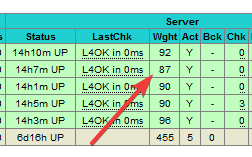

# Haproxy.AgentCheck

[](https://sonarcloud.io/dashboard?id=Haproxy.AgentCheck)
[](https://sonarcloud.io/dashboard?id=Haproxy.AgentCheck)
[](https://sonarcloud.io/dashboard?id=Haproxy.AgentCheck)
[](https://sonarcloud.io/dashboard?id=Haproxy.AgentCheck)
[](https://sonarcloud.io/dashboard?id=Haproxy.AgentCheck)

This application is a lightweight external agent installed on servers / VM / pods, exposing TCP & HTTP endpoints to report the server’s state to Haproxy LB. It's based on Kestrel / .NET Core 3.1, so it's very light.

With the reported health metric, Haproxy can dynamically adjust backend weight, and evenly load balance traffic between hosts. When a host metric spikes (ex a CPU going to 100% because of a VM on a failing host, or an infinite loop made by a tired developer), the reported weight to Haproxy is minimum, telling Haproxy to schedule the minimum traffic to this host.

This feedback loop reduce the blast radius in case of resource exhaustion.

> External agents have an edge over other types of health checks: they can send signals back to Haproxy to force some kind of change in state. For example, they can mark the server as up or down, put it into maintenance mode, change the percentage of traffic flowing to it, or increase and decrease the maximum number of concurrent connections allowed. The agent will trigger your chosen action when some condition occurs, such as when CPU usage spikes or disk space runs low.

See "Gauging Health with an External Agent" [on Haproxy blog](https://www.haproxy.com/fr/blog/using-haproxy-as-an-api-gateway-part-3-health-checks/).

In practice :

- You set a limit to 90% CPU on each probe in a 5 host cluster.
- In Haproxy configuration, you have a weight of 100 for all 4 backends.
- The Haproxy.AgentCheck on one host is called by Haproxy on TCP.
- Suddenly one host is at 40% CPU, Haproxy.AgentCheck returns the value : `up 13%`.
- Then Haproxy adjust the backend weight for this host, doing so prioritizes hosts with more resource available.

You can see the adjusted backend weights on the Haproxy-Gui directly (response is `up 87%` in the screenshot) :



## Supported OS, metrics

Currently, this application supports windows and linux, and the following metrics
- CPU
- IIS requests (windows only)

## Installation

Haproxy.AgentCheck should be installed as a windows service, in order to be independent of eventual IIS resource exhaustion.

## Configuration

Settings are defined via appsettings.config

```json
  "AgentCheckConfig": {
    "RefreshIntervalInMs": 2000,
    "CpuLimit": 90,
    "IisRequestsLimit": 40,
    "SystemResponse": "FirstOrder"
  }
```

## System response

Currently, two system responses are available :
- `Linear` : weight is computed to be linear to a defined limit. This is the best choice for environment where all nodes are homogeneous (IPC, number of cores, etc.), and all requests on the servers have the same resource consumption (CPU, etc).
- `FirstOrder` : weight is a first order system response. Best suited for heterogeneous environments, where

Example with a 80% limit :


All curves are crafted to return `100%` when x = 0, and `1%` when x = limit. (x is the current metric value, like CPU%). Returning 1 is a safety to avoid a full backend drain (happening if we return 0).

You can play with the curves [on this link](https://www.desmos.com/calculator/locua9nisb) (the variable `c` is the limit you will define in appsettings, like CpuLimit).
